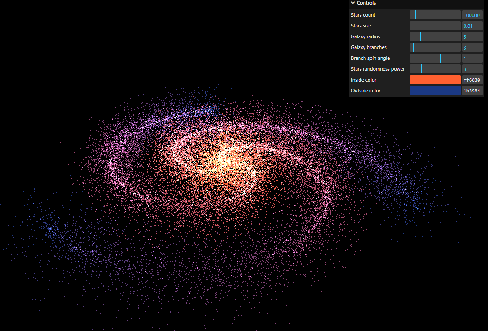

# Three.js haunted house

An interactive spiral galaxy generator using Three.js and lil-gui.

[](https://threejs-galaxy-apaydev.vercel.app)

## How to run it

After cloning the repo, run the following command to install the required dependencies:

```bash
npm i
```

Then, to start the development server, run:

```bash
npm run dev
```
